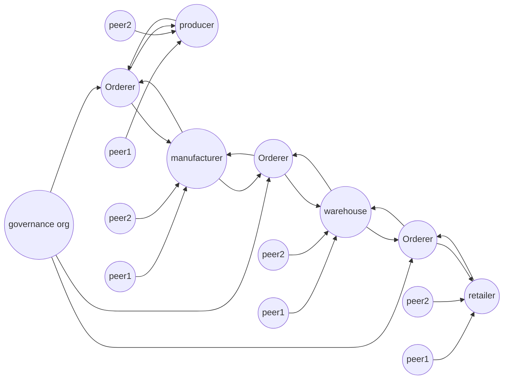

# Coffee POC

> Note : This repo uses fabric binaries & docker images of version 2.2

### This POC has 4 organizations
1. **teafarm** : works as producer
2. **tata** : works as manufacturer
3. **tatastore** : works as warehouse
4. **bigbazar** : works as retail seller



### About POC ###

Here in this POC we have built and deployed nodes for a total of five organisations :-
1. **teafarm** : works as producer
2. **tata** : works as manufacturer
3. **tatastore** : works as warehouse
4. **bigbazar** : works as retail seller
5. **governance** : works as government regulator

here the first 4 organisations runs peer nodes while the government organisation runs the orderer nodes. the nodes in the network can transact with each other through their specified channels that have been implemented:-
1. **mfd-prd-channel** : channel between the producer and manufacturer
2. **mfd-whs-channel** : channel between the producer and warehouse
3. **whs-rtlr-channel** : channel between the warehouse and retailer

there also exists by default the system channel called 'orderer-channel' which contains the orderer nodes and the Consortium organisation. In Fabric only members of a certain Consortium can create channels.

### Steps to run the network ###
***To start the network***
```bash
./run.sh
```
The above command will:
1. generate crypto materials
2. create channels
3. start containers
4. join channels
5. deploy chaincodes

***To shut down the network***
```bash
./networkDown.sh
```

***To run explorer***
```bash
cd explorer
sudo docker-compose up
```
login and password for each org can be found under adminCredential inside the json file inside the organisations config folder

***To shut down explorers***
```bash
sudo docker-compose down
```

***To run API***
```bash
cd api-ts
node index
```
